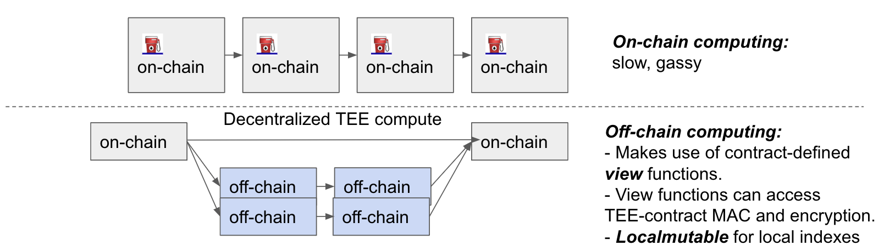

# Suatheby's

Welcome to Suatheby's. <br>
A Cross-chain Auction house built with SUAVE ⚡️🤖 Secret sharing through a Trusted execution environment (TEE)


# Imagine
<p align="center"> Buying an NFT on Arbitrum <br>
Using ETH on Polygon </p>

# How it works

1. Seller <br>
1.1 Upload data in confidential storage in TEE kettle
   * Data to be sold could be NFT on any chain, private key, etc.
2. Buyer <br>
2.2 Bid on asset on the desired chain
3. Reveal data to buyer through the off-chain contract viewing function

This is made possible with the unique architecture of Suave kettle running in TEE which brings enhanced privacy (no-one, not even the host OS, can see unencrypted data) and integrity (you can be sure the correct data, and only that data, is stored at all times).



# Future work
1. Enable the bidding process, like eBay
2. Data storage specification, NFT on different chains(arb, polygon)
3. ZK-SNARK the data and reveal only the necessary part of the data during the bidding process

## Running locally

#### Install dependencies

```bash
yarn
```

#### Start the web app. In `packages/app` directory, run

```bash
yarn start
```

This will start the UI at `http://localhost:3000/`
